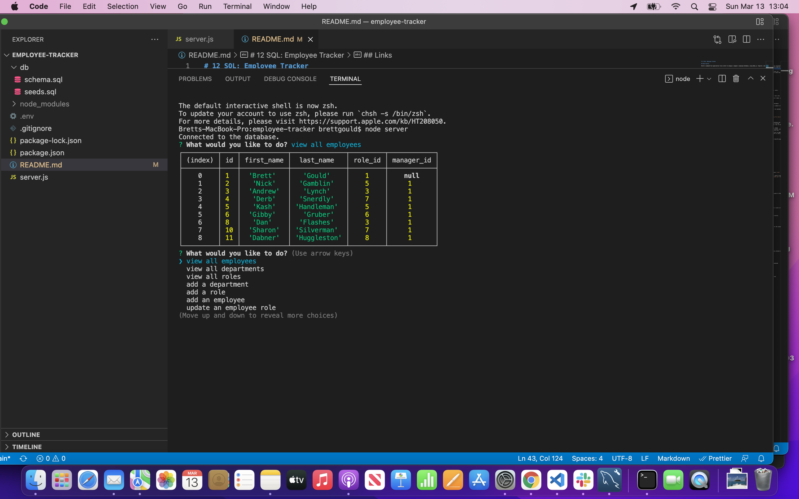

# 12 SQL: Employee Tracker

## Description

Build a command-line application from scratch to manage a company's employee database, using Node.js, Inquirer, and MySQL.

## Table of Contents

- [Screenshot](#screenshot)
- [Installation](#installation)
- [Usage](#usage)
- [Contribute](#contribute)
- [Questions](#questions)
- [Links](#links)

## Screenshot

## Installation

The user must install mySQL, console.table, dotenv, and inquirer to run this application.

## Usage

Use this application to track your employees.

## Contribute

Contact the application owner.

## Questions

If you have any questions, please contact:

- Brett Gould
- bgould86@gmail.com
- [https://www.github.com/bgould86](https://www.github.com/bgould86)

## Links

- Here is the repo: [https://github.com/bgould86/employee-tracker](https://github.com/bgould86/employee-tracker)
- Here is the video walk through: [https://note-taker-bdg.herokuapp.com/](https://note-taker-bdg.herokuapp.com/)
